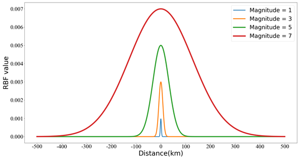

# Seismic Activity Characteristics in Sichuan-Yunnan Region Revealed by Big Data Analysis

### Description
This document presents three distinct big data visualization methods for earthquake catalog data, effectively illustrating the relationships among magnitude, frequency, occurrence time, and epicenter location within large-scale earthquake catalog datasets.

## 1. Scatter Plot of the Earthquake Catalog Dataset
<p align="center">
  <br />
  **2D Scatter Plot**
</p>

<p align="center">
  <br />
  **3D Scatter Plot**
</p>

## 2. M-T Plot
<p align="center">
  <br />
  **M-T Plot**
</p>

## 3. Earthquake Heat Map
<p align="center">
  <br />
  **Heat Map**
</p>

### Major Active Faults in the Sichuan-Yunnan Region
The solid lines in the figures represent the major active faults in the Sichuan-Yunnan region, labeled as follows:
1. Daliangshan Fault
2. Ganzi–Yushu Fault
3. Honghe Fault
4. Minjiang-Huya Fault
5. Lancang Fault
6. Lijiang–Xiaojinhe Fault
7. Litang–Batang Fault
8. Longmenshan Fault
9. Longriba Fault
10. Nantinghe Fault
11. Nujiang–Ayeyarwaddy Fault
12. Weixi–Qiaohou Fault
13. Xianshuihe-Anninghe-Zemuhe-Xiaojiang Fault
14. China-Burma Fault

*(Data source: [Link](https://210.72.25.135/cfm3d/achievement/achievements-list/190-2023-12-15-08-43-16))*

## 4. M-F Plot
<p align="center">
  <br />
  **M-F Plot**
</p>

This plot measures the damage degree of earthquakes of varying magnitudes, employing a visual characterization scheme using Gaussian kernel functions based on M-F diagrams.

## 5. M-F Plot Based on RBF Kernel Function
### 5.1 Function
<p align="center">
  <br />
  **Function**
</p>

### 5.2 Function Image
<p align="center">
  <br />
  **Function Image**
</p>

### 5.3 M-F Plot (1970-2020)
<p align="center">
  <br />
  **M-F Plot**
</p>

## 6. M-T Hotmap
<p align="center">
  <br />
  **M-T Hotmap**
</p>

## 7. Comprehensive 3D View
For a complete 3D visualization, view the following video:  
[](https://youtu.be/3_mQAKlumz4)

## How to Use
### 1. Installation

#### 1.1 Clone the Repository
First, clone the repository to your local machine:
```bash
git clone https://github.com/yourusername/your-repo.git
cd your-repo
```

#### 1.2 Create a Conda Environment
This project relies on several libraries, which are installed via the `environment.yml` file. Key dependencies include:
- **VTK**: For 3D visualization and rendering.
- **Pandas**: For data manipulation and analysis.
- **NumPy**: For numerical operations.
- **SciPy**: For spatial data processing with `cKDTree`.
- **tqdm**: For progress bars.
- **joblib**: For parallel computation.

Install all required dependencies:
```bash
conda env create -f environment.yml
conda activate seismic_vis_env
```

### 1.3 Usage
Run the desired script. For example:
```bash
python main.py --input dataset.csv --output result.vtk --parallel
```

## Examples
### Example 1: 3D Earthquake Catalog Scatter Plot
```bash
python ./src/catalog_scatter_vis.py 3D ./rawData/CENC_catalog_1970-2020.csv
```
This command inputs an earthquake catalog CSV file and outputs a PNG result and a VTK file for further visualization.

### Example 2: M-T Heat Map
```bash
python ./src/MT_hotmap_vis.py ./rawData/CENC_catalog_1970-2020.csv
```
This command also inputs an earthquake catalog CSV file, outputting a PNG result and a VTK file.

## Citation
If this work is useful to you, please cite the following source: He Pei et al., "Seismic Activity Characteristics in Sichuan-Yunnan Region Revealed by Big Data Analysis." This work is currently under review, and specific publication details will be provided upon acceptance.

## License
This project is licensed under the MIT License. See the [MIT License](LICENSE) file for details.

---

Feel free to modify any parts further! For citations, you can state that the paper is "currently under review" to keep it flexible until it's published.
