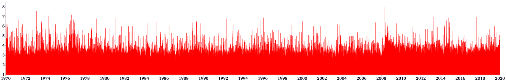

# Seismic Activity Characteristics in Sichuan-Yunnan Region Revealed by Big Data Analysis

### 0. Description
This document presents three distinct big data visualization methods for earthquake catalog data, effectively illustrating the relationships among magnitude, frequency, occurrence time, and epicenter location within large-scale earthquake datasets.

A brief comparison of the advantages and disadvantages of different earthquake catalog visualization approaches is summarized in the table below:

| **Method**                         | **Earthquake Frequency**   | **Occurrence Time**        | **Epicenter Location**      | **Magnitude**              | **Seismic Hazard**         |
| :--------------------------------- | :------------------------: | :------------------------: | :-------------------------: | :------------------------: | :------------------------: |
| **Traditional Methods**            |                            |                            |                             |                            |                            |
| 2D/3D Scatter Plot                 |           ○ (shaded)       |             ✕              |              ✓             |         ○ (shaded)         |              ✕             |
| M-T Plot                           |           ○ (shaded)       |              ✓             |              ✕             |         ○ (shaded)         |              ✕              |
| Heat Map                           |           ○ (shaded)       |              ✕             |              ✓             |         ○ (shaded)         |              ✕              |
| **Methods in This Paper**          |                            |                            |                             |                            |                            |
| M-F Plot                           |             ✓              |              ✕            |              ✓              |              ✓            |              ✕              |
| M-F Plot Based on RBF Kernel       |             ✓              |              ✕            |              ✓              |              ○ (shaded)    |              ✓              |
| Improved M-T Plot                  |             ✓              |              ✓            |              ✕              |              ✓             |              ✕              |

**Note:** &nbsp; ✓: Definitely represented &nbsp;&nbsp;&nbsp;&nbsp;&nbsp; ○: Optionally represented &nbsp;&nbsp;&nbsp;&nbsp;&nbsp; ✘: Not represented

## 1. Scatter Plot of the Earthquake Catalog Dataset
<p align="center">
  <br />
  2D Scatter Plot
</p>

<p align="center">
  <br />
  3D Scatter Plot
</p>

## 2. M-T Plot
<p align="center">
  <br />
  M-T Plot
</p>

## 3. Earthquake Heat Map
<p align="center">
  <br />
  Heat Map
</p>

#### The solid lines in the figures represent the major active faults in the Sichuan-Yunnan region, labeled as follows:
1. Daliangshan Fault
2. Ganzi–Yushu Fault
3. Honghe Fault
4. Minjiang-Huya Fault
5. Lancang Fault
6. Lijiang–Xiaojinhe Fault
7. Litang–Batang Fault
8. Longmenshan Fault
9. Longriba Fault
10. Nantinghe Fault
11. Nujiang–Ayeyarwaddy Fault
12. Weixi–Qiaohou Fault
13. Xianshuihe-Anninghe-Zemuhe-Xiaojiang Fault
14. China-Burma Fault

*(Fault Data Source: [Follow this link](http://www.cses.ac.cn/sjcp/ggmx/2024/609.shtml))*

## 4. M-F Plot
<p align="center">
  <br />
  M-F Plot
</p>

## 5. M-F Plot Based on RBF Kernel
This plot assesses the damage caused by earthquakes of varying magnitudes, utilizing a visual characterization scheme based on Gaussian kernel functions derived from M-F diagrams.

### 5.1 Function
<p align="center">
  <br />
</p>

<p align="center">
  <br />
  Function Image
</p>

### 5.2 Results
<p align="center">
  <br />
  M-F Plot Based on RBF Kernel(1970-2020)
</p>

<p align="center">
  <br />
  M-F Plot Based on RBF Kernel(2000-2010)
</p>

## 6. M-T Hotmap
<p align="center">
  <br />
  M-T Hotmap
</p>

## 7. Comprehensive 3D Animation
This video integrates over 420,000 earthquake entries of magnitudes 1.0 and above from the Sichuan-Yunnan region, covering the period from 1970 to 2020. It includes data on more than 160 three-dimensional active faults, high-precision topographic information, community velocity models, and the depth of the Moho surface, elucidating the seismic activity characteristics in this region over the past fifty years.  

[](https://youtu.be/3_mQAKlumz4?si=m6luMTRibVXmUQL6)
*(Complete 3D Visualization Video: [Visit on YouTube](https://youtu.be/3_mQAKlumz4?si=m6luMTRibVXmUQL6))*

## How to Use
### 1. Installation

### 1.1 Clone the Repository
Clone the repository to your local machine:
```bash
git clone https://github.com/peixyhe/seismic-catalog_vis_demo.git
cd seismic-catalog_vis_demo-master
```

### 1.2 Create a Conda Environment
This project relies on several libraries, which can be installed via the `environment.yml` file. Key dependencies include:
- **VTK**: For 3D visualization and rendering.
- **Pandas**: For data manipulation and analysis.
- **NumPy**: For numerical operations.
- **SciPy**: For spatial data processing with `cKDTree`.
- **tqdm**: For progress bars.
- **joblib**: For parallel computation.

Install all required dependencies:
```bash
conda env create -f environment.yml
conda activate seismic_vis_env
```

### 1.3 Usage
Run the desired script. If there are any unclear areas, please refer to the comments regarding the main function in each script. For example:

#### Example 1: 3D Earthquake Catalog Scatter Plot
```bash
python ./src/catalog_scatter_vis.py 3D ./rawData/CENC_catalog_1970-2020.csv
```
This command inputs an earthquake catalog CSV file and outputs a PNG result and a VTK file for further visualization.

#### Example 2: M-T Heat Map
```bash
python ./src/MT_hotmap_vis.py ./rawData/CENC_catalog_1970-2020.csv
```
This command also inputs an earthquake catalog CSV file, generating a PNG result and a VTK file.

## Citation
If this work is useful to you, please cite the following source: He Pei et al., "Seismic Activity Characteristics in Sichuan-Yunnan Region Revealed by Big Data Analysis." This work is currently under review, and specific publication details will be provided upon acceptance.

## License
This project is licensed under the MIT License. See the [MIT License](LICENSE) file for details.

---
